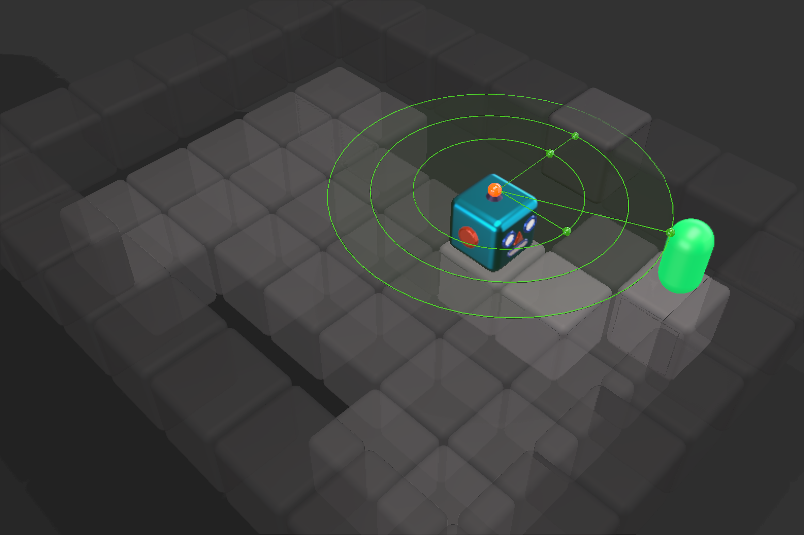

# CROP: Compact Reshaped Observation Processing

[[Paper](https://www.ijcai.org/proceedings/2023/0380.pdf)]

| | | | |
:---:|:---:|:---:|:---: 
|  |  |  |  | 
| Full Observation | Radius CROP | Action CROP | Object CROP | 

The safe application of reinforcement learning (RL) requires generalization from limited training data to unseen scenarios. 
Yet, fulfilling tasks under changing circumstances is a key challenge in RL. 
Current state-of-the-art approaches for generalization apply data augmentation techniques to increase the diversity of training data. 
Even though this prevents overfitting to the training environment(s), it hinders policy optimization.
Crafting a suitable observation, only containing crucial information, has been shown to be a challenging task itself.
To improve data efficiency and generalization capabilities, we propose Compact Reshaped Observation Processing (CROP) to reduce the state information used for policy optimization.
By providing only relevant information, overfitting to a specific training layout is precluded and generalization to unseen environments is improved.
We formulate three CROPs that can be applied to fully observable observation- and action-spaces and provide methodical foundation. 
We empirically show the improvements of CROP in a distributionally shifted safety gridworld.
We furthermore provide benchmark comparisons to full observability and data-augmentation in two different-sized procedurally generated mazes. 

## Setup

Our code is based on [Stable Baselines 3](https://github.com/DLR-RM/stable-baselines3), [AI safety gridworlds](https://github.com/google-deepmind/ai-safety-gridworlds), and [gym](https://github.com/Farama-Foundation/Gymnasium). 

### Requirements

- python 3.10
- cuda 11.6 or 11.7

### Installation

```sh
pip install -r requirements.txt
```

## Training

Example for training CROP in safety environments:

```python
from crop import * 
from util import TrainableAlgorithm
from ai_safety_gym import factory

# Init environment, wrapped with Radius CROP 
envs = factory(seed=42, name='DistributionalShift', spec='Train', wrapper=CROP('Radius'))
model:TrainableAlgorithm = PPO(envs=envs, path='results')

# Evaluation is done within the training loop
model.learn(total_timesteps=10e5, stop_on_reward=40)
model.save(base_path+"models/trained")
```

## Running Experiments

```sh
# Train CROP and baselines 
python -m run PPO CROP Object --env DistributionalShift Train
python -m run [PPO|A2C] [|CROP Radius|CROP Action|CROP Object|RAD] --env [Train|Maze7|Mazes7|Maze11|Mazes11]

# Use flag --test to run without writing out
# Use --path experiments/1-Train to write to path other than /results
# Display help for command line arguments 
$ python -m run -h

# Run evaluation & benchmark experiments
./eval
./bench
```

## Plotting

```sh
# Evaluation Train, Test & Heatmaps
python -m plot results/1-evaluation -m Validation Evaluation
python -m plot results/1-evaluation --heatmap Obstacle 

# Benchmark Train & Test 
python -m plot results/2-benchmark -m Validation Evaluation -g env
```

## Results 

### Evaluation: Robustness to Distributional Shift:
| Training Environment (HoleyGrid) | Training Environment (HoleyGrid)|
:---------------------------------:|:--------------------------------:
|  |   |

### Benchmark Comparison – Generalization Capabilities:
| Training Environment (RandomMaze7)      | Unseen Test Environment (SingleMaze7) |
:----------------------------------------:|:--------------------------------------:
|  |  |

| Training Environment (RandomMaze11)      | Unseen Test Environment (SingleMaze11) |
:----------------------------------------:|:--------------------------------------:
|  |  |


### Environments

| HoleyGrid | HoleyGridShift | SingleMaze7 | RandomMaze7 | SingleMaze11 | RandomMaze11 | 
 :---------:|:--------------:|:-----------:|:-----------:|:------------:|:------------:
|||||||
